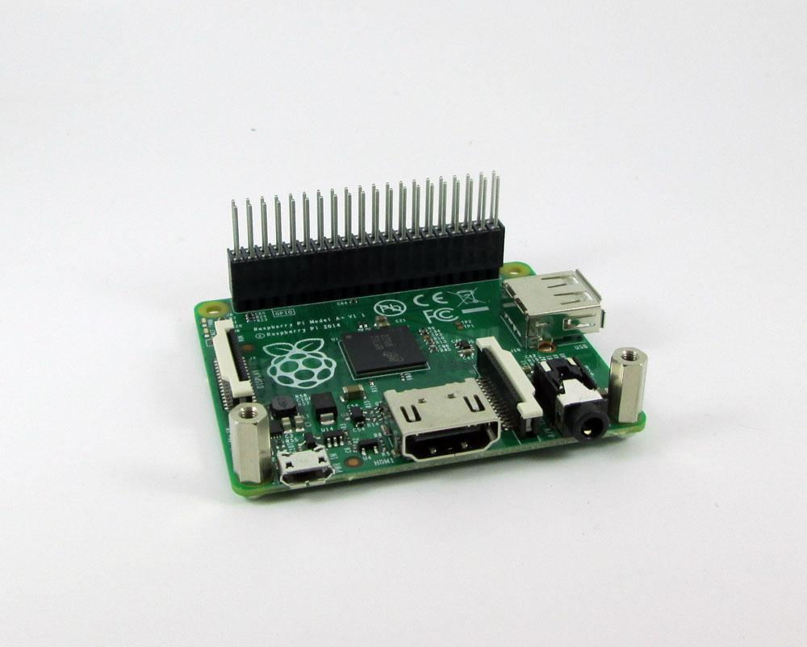
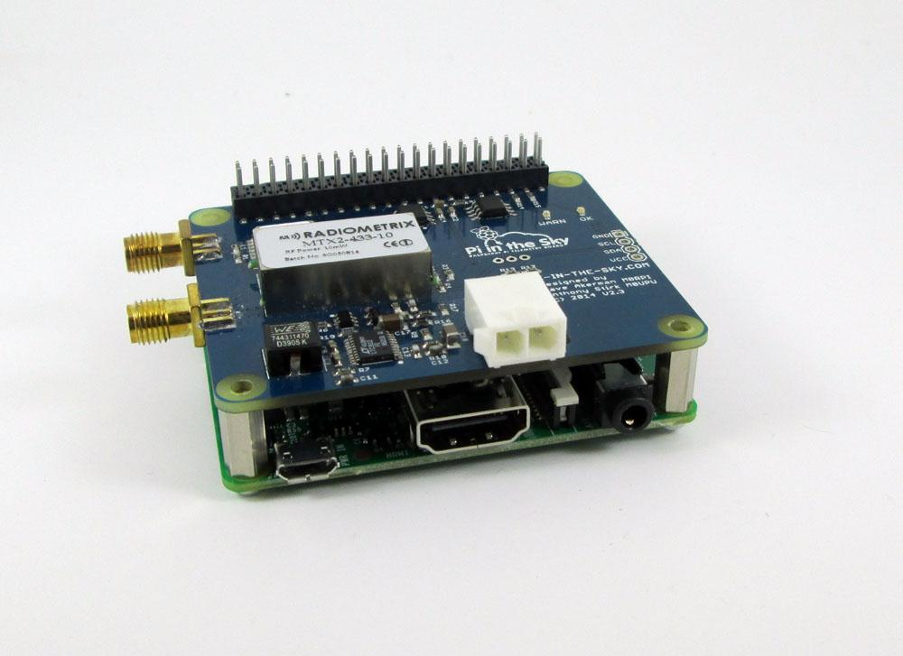
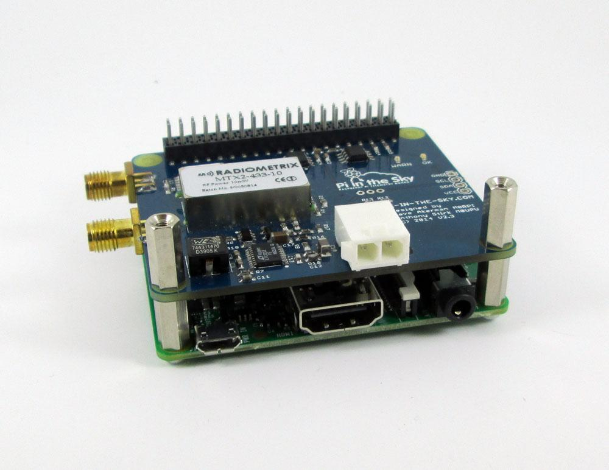
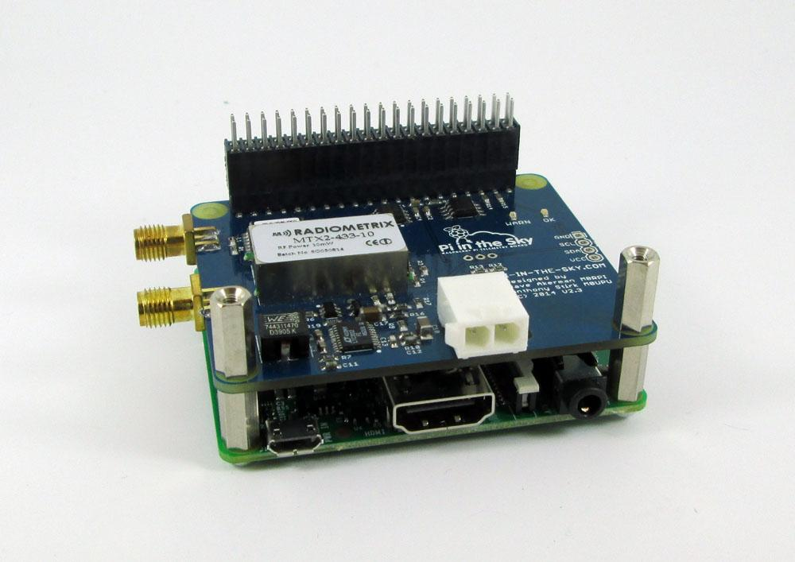
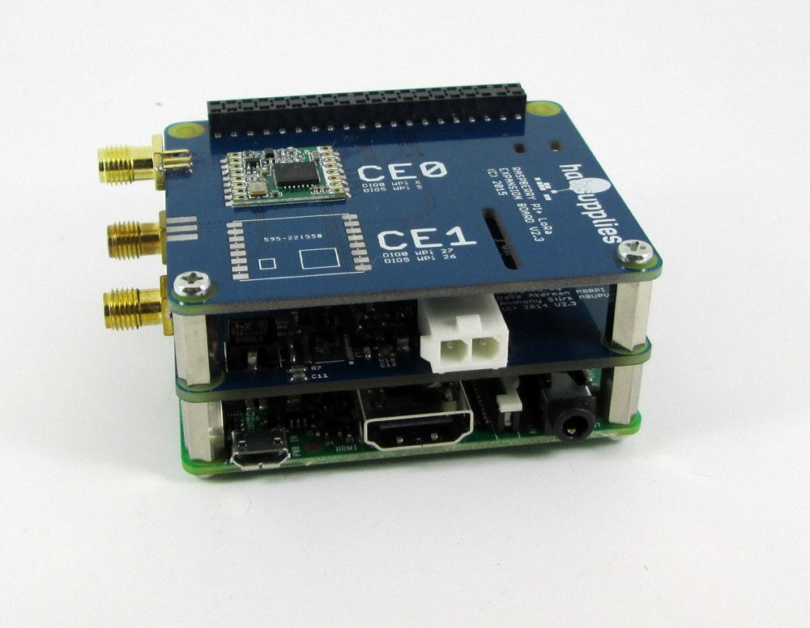

This is a guide designed to take a user who has obtained the basic [Pi in the Sky kit](https://store.uputronics.com/index.php?route=product/product&path=62&product_id=52) without any setup to a fully-functional tracker device (to be place on the high-altitude balloon). Any questions during the course of following this guide should be directed to [wchurch@whitemountainscience.org](mailto:wchurch@whitemountainscience.org).

# To Use This Document:

This document is best used when viewing the overall outline of the document.  To open the Outline, go to the *Tools* menu, and then select *Document Outline.*  Alternatively, press CTRL-ALT-A-H.

By using the outline, you can quickly find a section that you’re searching for or skip around between sections.  It also gives you a good idea of the progression of how the HAB is set up.

**Tip: **All the **blue** areas are commands that will need to be run on the command line

* * *

# Hardware Pre-Setup:

## Session 1

	**Read the above guide on how to use this document.**

	

**Note: **Most of this information is condensed from [http://www.pi-in-the-sky.com/index.php?id=board-connections](http://www.pi-in-the-sky.com/index.php?id=board-connections) and [http://www.pi-in-the-sky.com/index.php?id=stacking-guide](http://www.pi-in-the-sky.com/index.php?id=stacking-guide) 

On the hardware side, you must have the following parts for a basic testing setup (*these should all be included in either the Raspberry Pi kit or the Pi In The Sky kit*):

* Raspberry Pi main board

* Micro SD card (hopefully with the Raspberry Pi operating system installed; see below)

* Power brick (wall wart) for Raspberry Pi

* Pi in the Sky main board

* Pi in the Sky APRS board (the one with fewer components on top)

* GPS Antenna

* Standoffs for placing between stacked boards

You will also need these tools for working with the Raspberry Pi

* Monitor or projector with HDMI input (or a converter) - most monitors will work nowadays

* HDMI Cable

* USB Keyboard

* USB Mouse

* [USB Wifi dongle](https://www.amazon.com/Edimax-EW-7811Un-150Mbps-Raspberry-Supports/dp/B003MTTJOY) (older Raspberry Pis don’t have built-in wifi; the Raspberry Pi 3 does)

### Stacking the Boards

First, put together the Raspberry Pi, Pi in the Sky board, and the APRS board by stacking them. First, put on the main Pi in the Sky Board (the one with the large PITS logo on it) using this process:

**NOTE:** Your Raspberry Pi may look different from the one in these photos, but the steps remain the same. 

1. Install the "stacking header" over the normal pins on the Raspberry Pi. It should simply plug into the array of pins on the Pi, but make sure it covers all the pins and that no pins are bent.

2. Add the standoffs to the two holes opposite the pins by screwing the bolts in from the bottom into the standoffs.

3. Add the Pi in the Sky board by pushing it down on top of the header you added onto the first. It should be pretty snug.

4. Next, screw in the 12mm male/female standoffs in to the 11mm standoffs, to put the next board on.

5. Also, add another stacking header to the exposed pins of the previous

6. Next, put on the APRS board using a similar process, but with the main Pi in the Sky board as the base instead of the Raspberry Pi. (N*ote the board in this picture is not the same as the one we’re adding*)

Refer to [this guide](http://www.pi-in-the-sky.com/index.php?id=stacking-guide) for more information (though **note that we’re adding an APRS board, not a LoRa board, as the second stacked board**)

### Plugging everything in (for testing)

<table>
  <tr>
    <td></td>
  </tr>
  <tr>
    <td>This image shows the different connections on the Pi in the Sky board. Image from: http://www.pi-in-the-sky.com</td>
  </tr>
</table>

1. Plug the GPS Antenna into the "GPS Aerial" antenna port on the Pi in the Sky board. Refer to the image above to make sure you choose the correct antenna port, as they have the same connector.

2. Plug your HDMI cable into the monitor and the Raspberry Pi

3. Plug the keyboard and mouse in

4. Plug the power brick into the Raspberry Pi board in the micro USB slot 

The Pi should now power on. If you have installed the Raspberry Pi operating system, you should be presented with either a login page or the desktop. **In either case**, continue on to the Software setup below. Refer to [this guide](http://www.pi-in-the-sky.com/index.php?id=board-connections) for more information on hardware setup.

# Configuring the *Pi in the Sky* (PITS) software (3 sessions):

**First and foremost**, the username and password on the Pi are **_pi_**** (for the username,)** and **_raspberry_**** (for the password.)**  Remember these when it asks you.  Additionally, when it asks you for the ‘sudo’ password, simply enter the password above. For a look at what ‘sudo’ means, and other linux terms used in this document, refer to the Linux Glossary at the bottom of this document.

**Note: **Most of this information is condenced from [http://www.pi-in-the-sky.com/index.php?id=sd-card-image-from-scratch](http://www.pi-in-the-sky.com/index.php?id=sd-card-image-from-scratch) 

**Note****: **We’re assuming you already have the Raspberry Pi’s operating system, a derivative of the Debian flavour of Linux called Raspbian "Jessie," installed on the Pi’s SD card. If you don’t, we’ll supply this for you.  

The installation is pretty easy, with just one oddity: you’ll need to make sure to download the **_Jessie version instead of the newer Stretch version_**. To do this, follow [the online documentation](https://www.raspberrypi.org/downloads/noobs/) as normal, but **[download this fil**e](https://downloads.raspberrypi.org/raspbian_lite/images/raspbian_lite-2017-07-05/2017-07-05-raspbian-jessie-lite.zip) instead of one of the images they suggest. Once you have that file, the process should be similar, though you may end up skipping some steps because things are already set up. Alternatively, we can show you how.) 

Also note that your version of Raspbian may or may not have a "desktop environment" like a normal Windows / Mac computer -- it may only have a black and white text terminal (no mouse). In this case, the steps below should be similar (because we’re mainly using the terminal, but some configurations such as Wifi may be more involved.)

Hint: You can try running **startx **in your terminal which would start a desktop environment if it was available

## Session 2

Let’s start by changing some basic configurations in the Pi:

### Open terminal

Start by launching a terminal (command line interface.)  You can do this on some machines by pressing CTRL + ALT + T, or by clicking the little ‘screen’ icon in the upper right of the screen.

### Setting up Wifi

You’ll need to be connected to Wifi to download some software, so we’ll need to set this up. If you have a desktop environment, this is simple:

#### 	On Raspbian Desktop Environment

Click the small wifi-like symbol in the top right, select your network, and enter the password if needed. It should connect then.

#### 	In Terminal (Command Line)

This is more complex, and known to be finicky. We have an [internal document](https://docs.google.com/document/d/15QQFGtWF9OYZfOFw9Uf4HgVctYofZXyoNhFBCIx9Cl4/edit#) for setting this up but feel free to contact us with difficulties.

### Updating the Pi (very important)

To update the Pi there are two commands you will need to run in the terminal. These are: **sudo apt-get update** and **sudo apt-get upgrade**

These two command may take some time to execute, but once they are done your Pi will be updated and ready for setting up the PITS software. 

### Configure the Pi

Enter: **sudo raspi-config**
Using the arrow keys and tab to change the highlighted option, navigate the page to enable:

        1. Interfacing Options --> Enable Camera

        2. Interfacing Options --> Enable SPI (if you are going to use the LoRa board)

        3. Interfacing Options --> Enable I2C (if you will at some time use the BMP085 or BMP180 *temperature sensor*)

        4. Interfacing Options --> Serial --> Say No to the serial "login shell" option, and then Yes to “hardware serial”

**WARNING: If there no second window about hardware serial, STOP, run ****sudo apt-get upgrade****, and then repeat this step. **(Your raspi-config program is not up to date in this case)

        5. Interfacing Options --> Enable One-Wire support

        6. Advanced Options --> Memory Split --> Change the value to 144 (this is the GPU memory)

Now either say **yes** to the reboot request or enter **sudo reboot** to restart the Pi.

### Enable use of Serial Port

#### Disable TTY login over serial

We must additionally disable *tty* login via the serial port.  Enter:

**sudo systemctl mask serial-getty@ttyAMA0.service**

We also have to edit a text file.  Enter: 

**sudo nano /boot/cmdline.txt**

You have to **remove** the section that says, if it exists: **console=serial0,115200**

Because of the way Raspbian installs there isn’t a way to ensure this is at line number *nnn* or a similar identifier. Instead, search the file and just make sure it *doesn’t exist.*  Close the file by pressing CTRL-X and then Y (capital Y)

#### Disable Bluetooth

If running on a Pi Zero or a Pi V3, we’ll need to disable the bluetooth module because the module uses the serial port as well. Enter:

**sudo nano /boot/config.txt**

Go to the end of the file and add a line:

**dtoverlay=pi3-disable-bt**

If there’s already a line in the file that says **dtoverlay=<something>**, simply ignore it and add your line normally

**	**Finally, run this command:

**		sudo systemctl disable hciuart**

## Session 3

### Install git

by running: **sudo apt-get install git**

(this is used to install other software)

### Install pigpio

Now install the Pi’s GPIO (general purpose in/out) command line interface by:

**cd ~**

**wget abyz.co.uk/rpi/pigpio/pigpio.zip**

**unzip pigpio.zip**

**cd PIGPIO**

**make**

**sudo make install**

The last step above may take some time to finish.

### Install WiringPi

	First uninstall if necessary (first two commands), then install (last command)

**		sudo apt-get purge wiringpi **

**		hash -r**

**sudo apt-get install wiringpi**

### Install imagemagick

We’ll need to install imagemagick in order for some of the balloon-side scripts to work.  Simply run:

**sudo apt-get install imagemagick**

### Install gphoto2

	This is another application needed for processing the balloon images

**sudo apt-get install gphoto2**

### Install exiv2

This application is (only) needed for adding text onto the images (ex. altitude, lat/long, etc.)

**sudo apt-get install exiv2**

### Install SSDV (image transcoding software):

**Make sure to install this even if you don’t need it; **missing this step has caused many people lots of confusion on several occasions**.**

**cd ~**

**git clone https://github.com/fsphil/ssdv.git**

**cd ssdv**

**sudo make install**

### Install fswebcam

(this is only necessary if you want to use a USB webcam, but because it requires virtually no space and the confusion caused by not knowing about this in the future if you change your mind warrants that you install this now:)

**sudo apt-get install fswebcam**

## Session 4

### Installing Core Tracker Software (PITS)

The following will download and then install the tracker software, setting up scripts to start it when the Pi is turned on and adding a default configuration file. Run these commands in the terminal:

	**cd ~**

**	git clone https://github.com/PiInTheSky/pits.git**

	**cd pits**

**	./build**

		

	(The last command may take a while, likely about 10 to 20 minutes.)

### Configuring Tracker Software

When the tracker finishes compiling, we need to modify the configuration a bit.

We do this by editing the file /boot/pisky.txt (using the following):

	**sudo nano /boot/pisky.txt**

		

You will see several options already set, but we’re only editing a couple. The rest can be left as-is.

#### Configuring RTTY

Make sure to change the **payload** setting to a unique value, say **TESTING**.  For example, use something like:

**payload=TESTING**

#### 	Configuring APRS

To enable APRS, you *must have* the following lines; their values can, however, be changed:

**APRS_Callsign= TESTINGHAB** # Change this once you get 

# a HAM license

**APRS_ID=11** # 11 signifies this is a balloon, as opposed to a car

**APRS_Period=1**

**APRS_Offset=10**

**APRS_Random=5**

See the [Main PITS docs](http://www.pi-in-the-sky.com/index.php?id=aprs-configuration) for more extensive explanations.  **NOTE:  **You don’t need to include the orange lines of code.  Those are comments, and ignored by the computer when the code is read.  You can, of course, add any comments you want or find necessary.  Just start your comment with a **#**.

#### 	Configuring Camera

Modes (the value of the "**camera**" configuration parameter for your needs):

<table>
  <tr>
    <td>Config setting</td>
    <td>Function</td>
    <td>Use</td>
  </tr>
  <tr>
    <td>G/g </td>
    <td>gphoto2</td>
    <td>USB Camera (Canon connected via USB, etc...you must ensure your model is compatible with gphoto2 online.)</td>
  </tr>
  <tr>
    <td>U/F/u/f</td>
    <td>fswebcam</td>
    <td>USB webcam, (we recommend this for the mean time, also see below;)</td>
  </tr>
  <tr>
    <td>N/n</td>
    <td>No camera</td>
    <td>-</td>
  </tr>
  <tr>
    <td>Y/y/1/TC/c</td>
    <td>CSI (Pi) camera</td>
    <td>Raspberry Pi camera, (this is another option, also relatively easy to use and  configure.)</td>
  </tr>
</table>

Again, find the **camera **configuration parameter, and set it to the mode from above that describes the type of camera you’re using.  For example, if you’re using the Pi cam, use:

**camera=Y**

Once you’ve setup the configuration, the tracker should be all set to transmit to a properly-configured ground station! Just restart using **sudo reboot** to start transmitting.

**Note: **the tracker will automatically start when the Pi is turned on, running in the background, and will automatically restart if it crashes.

If you want to see the output from the commands  (or run them yourself ) for debugging, run the following commands to kill the background tracker: 

	**sudo killall startup**

**sudo killall tracker**

**	**Then the following commands will allow you to run the tracker from the terminal:

**cd ~/pits/tracker**

**sudo ./tracker**

### (Optional) Add overlays with time/GPS on images

Run the following command on the Pi to install imagemagick (if you haven’t already)

sudo apt-get install imagemagick

Then, run these commands to download our script to add the overlays

cd ~/pits/tracker

wget [https://raw.githubusercontent.com/wmsi/hab-scripts/master/hab/image-processing/process_image](https://raw.githubusercontent.com/wmsi/hab-scripts/master/hab/image-processing/process_image)

		chmod +x process_image # make sure it can be executed

The script is called by the tracker software to add the overlays, using the program imagemagick

		

		Restart the Pi now to restart the tracker.

### (Only if you’re using WMSI’s Nichrome Cutdown Method) Add Cutdown Scripts

		Follow [these instructions ](https://docs.google.com/document/d/1rieX-uNmAr2Uhw3OzbViHTt83vMpPBDO8XLKl2WadVs/edit#heading=h.3d6hs2rcu6fm)to download and install the script

# Building the Antennas (2 sessions):

## Session 5 & 6

We have written up two documents for building the kind of antennas best for RTTY and APRS

    1. Building the RTTY antenna: [Robust 1/4 Wave Ground Plane Design](https://docs.google.com/document/d/1ir4soDOKcdYurfY3qRSCPEqghc8tB6O9VS1mHlOvXKc/edit)

    2. Building the APRS antenna: [Robust 1/2 Wave Dipole Design](https://docs.google.com/document/d/1PoSh1W3TGm5R1HLLZX8g_40S8dvAOiOWa_fejcZaGgg/edit)

Once they’re done and have the correct connectors, connect the APRS antenna to the upper board connector and the RTTY antenna to the open connector on the main Pi in the Sky board.

# Next Steps:

In order to continue testing the Pi in the Sky system, you will need to acquire a HAM Technician License and Callsign. The Technician License is required in order to transmit at the frequencies used for RTTY and APRS. [This is a link to the ARRL website](http://www.arrl.org/licensing-education-training) which can  provide more information on Amateur Radio Licensing. Alternatively we can work with you in future workshops and utilize our WMSI callsign.  

# Linux Glossary

## Definitions of Terms

**sudo**** **- The use of **sudo **in Linux is like using an administrator password in Windows. By 

placing **sudo **in front of a command, you are letting Linux know that you have permission to be executing that command.

Some examples of when you might use this can be seen below, and throughout this document, but they include: modifying certain important system files, shutting down or rebooting the computer, or changing system configuration settings.

Here’s a [funny illustration of what this command does](https://www.xkcd.com/149/)

 

**sudo reboot / sudo shutdown**** **- These commands allow you to reboot and

shutdown your Linux machine. Notice that **sudo** is needed at the beginning of these commands because higher privileges are required for Linux to reboot or shutdown your computer.  

**sudo apt-get update / sudo apt-get upgrade**** **- These two commands

are used for updating the software on your Linux computer. You run the **sudo apt-get** **update **command first, and once that finishes you run **sudo apt-get upgrade**. 

These commands work together to fully update your Linux machine. **Sudo apt-get update** updates the *list* of all the software packages on the computer, as well as the versions of all of these. You then use **sudo apt-get upgrade** to actually *install* the newer versions of these software packages. These commands should be run periodically, and definitely if it is the first time you are using your Raspberry Pi. It is also a good idea to update everything before you start installing software for a new project. 

**sudo raspi-config**** **- This command allows you to access a number of settings to 

Configure the Raspberry Pi. It is important to note that this command is specific to Raspberry Pi’s, more specifically to the operating system Raspbian. 

The menu that appears when you run this command will allow you to configure different aspects of your Pi, such as enabling a camera, or changing passwords, etc. To navigate the menu, use the arrow keys to move up and down or side to side in the menu. Then to move from the menu to the Finish button, hit the TAB key, and then the ENTER key when you are on the correct button. 

For more information about raspi-config please refer to [this document on the Raspberry Pi website](https://www.raspberrypi.org/documentation/configuration/raspi-config.md).

**nano / sudo nano**** **- Nano is a text editor inside of Linux, like Notepad or Microsoft 

Word on Windows. The only difference is that when you use nano, you use it inside the terminal (this means you **can’t use the mouse** to navigate; only the keyboard). While you can use nano with just the command **nano**, it is recommended that you prepend it with **sudo** if you are editing files, as shown in the tutorial above. **It is important to note that** you must be careful when doing this, since using the **sudo nano** command can give you access to a number of files which you do not want to edit. Just be careful when typing in the file location of the file you want to modify and you will be fine. If you do run into an issue where you open the incorrect file, just press CTRL + X to exit the file, and choose No if it asks you to save the changes. 

An example of how to use the **sudo nano** command is as follows: **sudo nano /tmp/file.txt**. This command will open the text file file.txt in the tmp folder. Once inside nano, you can make all the changes you need like a regular text editor. Once you are finished, press CTRL + O to save the file, and then CTRL + X to exit the file.

Note also that because you’re editing files in the terminal, it is **difficult to copy/paste**. If you’re on the main Raspbian desktop, however; you can still select text and right click to copy/paste. Just make sure that you move the cursor to where you want to paste the text before you click "paste."

**ls**** **-    The **ls** command is used to list the files in your current directory (like the view you 

get in a file browser). You can also use a command such as **ls /home/pi/**, will list all of the files located in the pi’s "home directory". 

For more information on all the different options for using **ls**, refer to [this article](http://www.rapidtables.com/code/linux/ls.htm).

**cd **-   The **cd** command is used to change the folder you are currently working in. 

Entering the **cd **command by itself, or** cd ~**, will take you back to your "home directory," the start of where all your personal files are usually stored. 

Using the command with a path after it, such as **cd /boot/**, will take you to the boot folder. Finally, the command **cd ..** will take you to directory above the one you’re currently in (the parent directory). You’ll often hear people say to "**cd** into" a certain directory.

Note that when entering paths (for any command), you should pay attention to the difference between **relative and absolute paths**. However, the only difference between these types of paths is that **relative paths **are relative to the folder you’re currently in (i.e. the folder you **cd-**ed into), while **absolute paths** are relative to the "root" directory of your computer, usually designated as **“/”**. For example, if you’ve **cd-**ed into the root directory (i.e. **cd / **) and then run **cd boot** (specifying a *relative path* called **boot**), you’ll be in the same folder as if you had run **cd /boot **(specifying an *absolute path* called **/boot**) from *any* folder on the computer (you don’t have to be **cd-**ed into **/.**

For more information on all the different uses of the **cd** command, refer to [this article](http://www.rapidtables.com/code/linux/cd.htm). 

## CLI Tips and Tricks

This section will just provide you with a few helpful tips when using the terminal in Linux.

**Opening the Terminal **- To open the terminal, press CTRL + ALT + T, or click the little

‘screen’ icon in the upper right of the screen.

**Up Arrow in Terminal **- After you have entered a command in the terminal, you can press 

the up arrow to quickly re-enter the command you just entered. Also, if the command you want is a few commands back, you can continue using the up arrow to navigate to your command. 

**TAB Key for Autocomplete **- As you are in the process of typing a command, you can 

press the TAB key to have the terminal autocomplete the command for you. You can also press the TAB key twice to open a list of all possible ways to finish the command you are typing. 

**Note: **in some cases (i.e. using some command-line programs), this won’t work. However, it should work with most commands when you’re typing in filenames or other names that the computer should have a list of, such as **cd**, **ls**, **nano**, **sudo apt-get**, etc

**Pasting Commands**

When running multiple lines of commands, you can simply copy and paste the lines into the command prompt and they will all run as needed. You should try to have a sense of what they’re doing before though, because they will run so fast you may not see an error!

